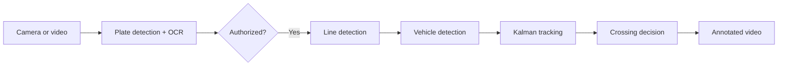

# Vehicle Line-Crossing Detection with OpenCV

A real-time computer-vision system that combines license-plate access control, continuous-line detection, vehicle tracking and crossing alerts using classical OpenCV techniques.

The project deliberately avoids pretrained object detectors: vehicle motion is extracted with background subtraction, the reference line with Canny and Hough transforms, and the trajectory is stabilized with a Kalman filter.

## Pipeline



## What it demonstrates

- License-plate candidate detection from geometric contours
- OCR with Tesseract and Spanish plate-format validation
- Continuous-line detection with Canny edges and a probabilistic Hough transform
- Moving-vehicle segmentation with MOG2 background subtraction
- Constant-velocity tracking with an OpenCV Kalman filter
- Stable side estimation with a neutral margin to avoid noisy crossing events
- Real-time overlays, FPS reporting and annotated video export

## Demo videos

- [Continuous-line crossing detection](videos/linea_continua.avi)
- [Dashed-line control case](videos/linea_discontinua.avi)
- [License-plate detection and OCR](videos/deteccion_matriculas.mp4)
- [License-plate access control](videos/seguridad_matricula.avi)

## Project structure

| File | Responsibility |
| --- | --- |
| `main.py` | CLI, video loop, state transitions, recording and visualization |
| `plate_detector.py` | Plate-region detection, OCR and format validation |
| `security.py` | Configurable authorized-plate comparison |
| `line_detector.py` | Continuous-line detection with Canny and Hough |
| `car_detector.py` | Motion-based vehicle detection |
| `tracker.py` | Kalman-filter trajectory smoothing |
| `drawer.py` | Bounding boxes, line, center point and FPS overlays |
| `calibration.py` | Offline camera calibration from chessboard images |

The full academic report is available in [Informe_Proyecto_Final_JavierBertran.pdf](Informe_Proyecto_Final_JavierBertran.pdf).

## Installation

Python 3.10 or newer is recommended.

```bash
git clone https://github.com/bertranvidal/cv-line-crossing-detection.git
cd cv-line-crossing-detection
python -m venv .venv
```

Activate the environment:

```bash
# Linux or macOS
source .venv/bin/activate
```

```powershell
# Windows PowerShell
.venv\Scripts\Activate.ps1
```

Install the Python dependencies:

```bash
pip install -r requirements.txt
```

License-plate OCR also requires the native [Tesseract OCR](https://github.com/tesseract-ocr/tesseract) executable. Add it to `PATH`, set `TESSERACT_CMD`, or pass `--tesseract-cmd`.

## Usage

### Run with a webcam

```bash
python main.py --source 0 --skip-security
```

### Process a recorded video

```bash
python main.py \
  --source videos/linea_continua.avi \
  --skip-security \
  --output outputs/annotated_crossing.avi
```

### Enable license-plate access control

```bash
python main.py --source 0 --authorized-plate 0000AAA
```

If Tesseract is not on `PATH`:

```powershell
python main.py --source 0 --authorized-plate 0000AAA --tesseract-cmd "C:\Program Files\Tesseract-OCR\tesseract.exe"
```

Press `q` to stop. The annotated recording is written to `outputs/line_crossing_output.avi` by default.

## Configuration

| Argument | Purpose | Default |
| --- | --- | --- |
| `--source` | Camera index or video path | `0` |
| `--output` | Annotated video path | `outputs/line_crossing_output.avi` |
| `--authorized-plate` | Plate allowed through the security stage | None |
| `--skip-security` | Run only detection, tracking and crossing logic | Disabled |
| `--tesseract-cmd` | Explicit Tesseract executable path | `PATH` / `TESSERACT_CMD` |

## Design assumptions and limitations

- Motion detection assumes a mostly static camera.
- The largest moving contour is treated as the vehicle, so the system is designed for one main vehicle at a time.
- The longest Hough segment is treated as the reference line.
- OCR is tuned for the current Spanish format of four digits and three letters.
- Lighting, perspective, occlusion and camera movement can reduce accuracy.
- This is a controlled academic prototype, not a production traffic-enforcement system.

## Project context

This was developed as a two-person university computer-vision project. Responsibilities overlapped across the system; my main focus was vehicle detection, line detection, crossing logic and integration of the final demo.

## License

Released under the [MIT License](LICENSE).
